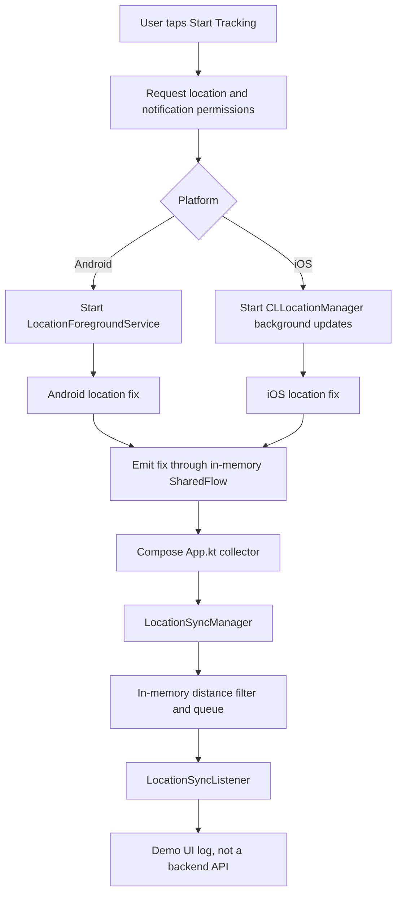
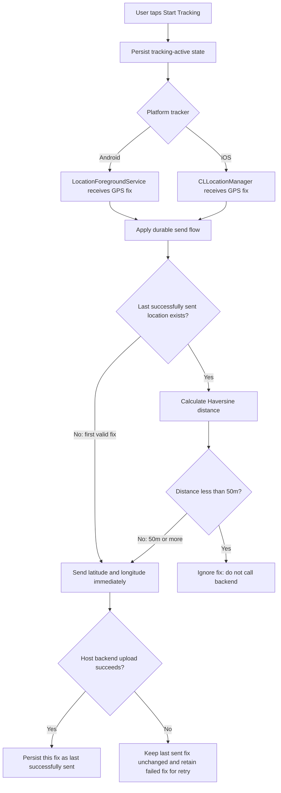

# Location Tracking Flow

## Purpose

This document explains the Kotlin Multiplatform (KMP) tracker as it works today on Android and
iOS, and defines the simplified target flow for sending location to a host application's backend.

The target scope is intentionally small:

- send latitude and longitude immediately for an accepted location fix;
- do not send a location that is less than 50 metres from the last location successfully sent to
  the backend.

Schedule windows, check-in/check-out, periodic batch sync, accuracy-policy changes, and other
policy rules are outside the scope of this flow.

## Current implementation

When the user taps **Start Tracking**, the app requests the required permissions and starts the
platform tracker:

- **Android:** `LocationForegroundService` subscribes to `FusedLocationProviderClient` updates.
- **iOS:** `CLLocationManager` starts standard location updates with
  `allowsBackgroundLocationUpdates`, `pausesLocationUpdatesAutomatically = false`, and the
  background-location indicator enabled. `Info.plist` declares the `location` background mode.

Both platform trackers emit each fix through an in-memory `SharedFlow`.

While the Compose app is alive, `App.kt` collects that flow and passes the fixes to
`LocationSyncManager`. The manager applies the distance filter, holds accepted fixes in an
in-memory queue, and eventually calls `LocationSyncListener`. The demo listener only writes an
entry to the UI log: it does not make a real backend request.



### Why delivery stops after the app is destroyed

The Android foreground service or iOS location manager owns location collection, but the current
sync manager, pending queue, and listener are owned by the Compose app process. They are in memory
only. If that process is destroyed, there is no durable backend-delivery path, so new location
fixes cannot reach the host callback.

Android termination cases are different:

- **User swipes the app away from Recents:** a started foreground service can usually continue,
  and `START_STICKY` asks Android to recreate it after process pressure. The current app-side sync
  callback is still lost when the app process is gone.
- **Android kills the process for resources:** Android may later recreate a sticky foreground
  service, but in-memory state and the app-side callback are lost.
- **User force-stops the app from Settings:** Android stops the service and prevents normal
  background restart. The user must open the app and start tracking again.

iOS lifecycle cases are different:

- **App moves to the background or is suspended:** `CLLocationManager` can continue to deliver
  updates when the user has granted **Always** location permission and the `location` background
  mode is declared. The blue background-location indicator is shown. The app must remain alive for
  the current in-memory callback path to work.
- **iOS terminates the app:** the current location manager, queue, and callback are destroyed.
  The existing standard-location implementation does not persist enough state to restore backend
  delivery automatically, so it must not be relied on after termination.
- **User force-quits from the app switcher:** background tracking stops. iOS does not relaunch the
  app for normal location updates until the user opens it again.

## Target simplified flow

The platform background tracking component must own collection, filtering, durable tracking state,
and the hand-off to the host application's durable upload mechanism. That component is
`LocationForegroundService` on Android and `CLLocationManager` plus the iOS app background
execution path on iOS. The UI only starts/stops tracking and displays status; it must not be the
only route by which a location reaches the backend.



### Sending rules

1. The first valid location fix after tracking starts is sent immediately.
2. Compare every later fix with the **last location successfully sent to the backend**, not the
   last fix merely received or queued.
3. If the calculated distance is **less than 50 metres**, do not send the fix.
4. If the distance is **50 metres or more**, send the fix immediately.
5. Update the stored last-sent location only after the host backend confirms success.
6. If the upload fails, do not advance the last-sent location. Retain the failed fix in durable
   storage so it can be retried.

### Minimal backend payload

The host application's upload implementation receives at least:

```text
latitude: Double
longitude: Double
timestampMs: Long (optional, recommended)
```

The SDK must not contain an HTTP client or backend URL. Instead, the host application supplies the
upload implementation. That implementation must remain available to background work, rather than
being a callback that exists only while a Compose screen is alive.

## Required architecture changes for the target flow

- Persist whether tracking is active so the Android foreground service can restore its intent
  after normal process recreation and the iOS app can restore tracking when it next launches.
- Persist the last successfully sent latitude, longitude, and timestamp.
- Persist failed uploads or an upload queue for retry; never treat an unsuccessful upload as sent.
- Move the distance decision and upload hand-off into the platform background layer: Android
  foreground service and iOS `CLLocationManager` background execution path.
- Keep the Compose UI limited to start/stop actions and state presentation.

## Acceptance checklist

- A developer can see why the current implementation loses backend delivery when the app process
  is destroyed.
- The 50m rule is explicit: `< 50m` does not send; `>= 50m` sends.
- Android Recents swipe, Android process death, Android force-stop, iOS backgrounding, iOS
  termination, and iOS force-quit are described separately.
- All nonessential tracking-policy features are explicitly deferred.
