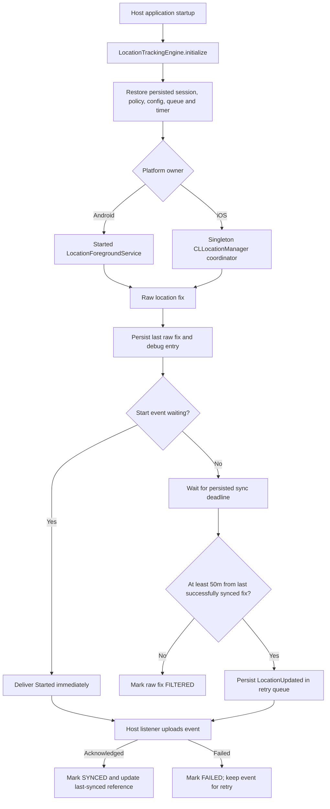

# Production KMP Location Tracking Lifecycle

## Scope and defaults

This library uses one shared tracking state machine for Android and iOS. The platform collects
raw fixes; the shared session owns policy evaluation, durable event delivery, retry state, and
the 50m synchronization rule.

The balanced default profile is:

| Concern                          | Default                    |
|----------------------------------|----------------------------|
| Raw location request             | about every 30 seconds     |
| Platform displacement            | 20m                        |
| Backend synchronization interval | 5 minutes (backend policy) |
| Backend displacement threshold   | 50m (backend policy)       |

Android passes the raw interval and platform displacement to Fused Location. iOS uses standard
Core Location updates with the same displacement and restarts its standard service only when no raw
callback arrives for the configured interval. This keeps the raw-fix target consistent without
changing the common 50m upload rule.

The host application provides the authenticated API uploader. The SDK does **not** contain an HTTP
client, endpoint, or credentials.

## Architecture

`LocationTrackingEngine` is the only lifecycle entry point. It is initialized once by Android's
`Application` and iOS's `App` initializer, before Compose renders. The screen only requests
permission, invokes Check In/Out in manual mode, and renders the persisted state. It does not own
generic Start/Stop tracking controls.



### Persistent session state

The Android `SharedPreferences` and iOS `NSUserDefaults` stores persist:

- active flag and session identifier;
- active backend policy and raw-collection config;
- last raw location and last successfully delivered location;
- last/next sync timestamps;
- pending backend events and last error;
- debug records for the current session.

Only a successful host acknowledgement advances the `lastSuccessfullyDeliveredLocation` reference.
A failed event remains queued and is retried after initialization and on the next synchronization
attempt. The engine calculates the next interval from the persisted deadline, preventing duplicate
timers after a normal process recreation.

## Event and synchronization behavior

The host receives typed `LocationTrackingEvent` values:

- `Started(firstLocation)` — sent as soon as the first valid fix arrives after start;
- `LocationUpdated(location)` — considered only at a sync interval;
- `Stopped(lastKnownLocation, reason)` — sent immediately on user or policy stop, regardless of
  distance.

Payload locations include `latitude`, `longitude`, `timestampMs`, and optional accuracy, speed,
bearing, and altitude.

For an ongoing `LocationUpdated` decision:

1. Continue collecting every accepted platform fix. Do not upload each raw callback.
2. At `syncIntervalMinutes`, compare the latest raw fix with the **last successfully synced** fix.
3. `< 50m` is `FILTERED`; no API request is made.
4. `>= 50m` is queued as `PENDING` and delivered immediately to the host listener.
5. A `true` listener result marks the matching record `SYNCED` and moves the reference point.
6. `false` or an exception marks it `FAILED`, retains it in the durable retry queue, and leaves the
   reference point unchanged.

`Started` and `Stopped` bypass both the interval and the 50m filter. Exactly 50m is delivered.

### Status definitions

| Status     | Meaning                                                                                          | Transition                        |
|------------|--------------------------------------------------------------------------------------------------|-----------------------------------|
| `PENDING`  | A raw fix is awaiting its interval decision, or an event is waiting for backend acknowledgement. | `SYNCED`, `FAILED`, or `FILTERED` |
| `SYNCED`   | The host confirmed backend acceptance.                                                           | Final                             |
| `FILTERED` | The interval decision found movement below the configured threshold. No upload was attempted.    | Final                             |
| `FAILED`   | The host upload threw or returned `false`; the event remains queued.                             | `SYNCED` after retry              |

All transitions happen in common KMP code. Android and iOS therefore use the same displacement,
retry, and status logic.

## Backend-controlled policy

The host supplies complete `LocationTrackerPolicy` data through
`LocationTrackingEngine.updatePolicy(policy)`. The SDK never fetches policy itself.

`canStart` requires all of the following:

- `isTrackingEnabled` is true;
- `TIME_RANGE` has a non-null `scheduleWindow` and the local time is inside it (overnight windows
  are supported); a missing window fails closed;
- `CHECK_IN_OUT` is currently `isCheckedIn`;
- no session is already active.

### Time Range

`TIME_RANGE` reconciles immediately and schedules the next local start/end boundary. Android also
persists a one-shot `AlarmManager` wake-up so an inactive process can reconcile at the next
boundary. A running Android foreground service survives an ordinary Recents swipe and continues to
reconcile in its own process.

iOS runs boundary reconciliation while the application remains running/backgrounded. It also
enables significant-location monitoring as a best-effort re-entry signal after normal system
termination for both Time Range and an active Check-In session. It is not an exact scheduled
restart mechanism and cannot relaunch an app that the user force-quit from the App Switcher.

Schedule windows are start-inclusive/end-exclusive: a `09:00–17:00` policy starts at 09:00 and is
no longer eligible at 17:00. This avoids an unintended extra minute of tracking at the end boundary.
The host UI should display schedule information only; it must not present Start/Stop controls for
this automatic mode.

### Check-In / Check-Out

Use `requestCheckIn()` and `requestCheckOut()` with a `CheckInOutListener`. The host executes its
attendance API and returns the updated authoritative policy. Only that policy starts or stops the
engine; the SDK does not infer a check-in from a UI control.

The host UI exposes Check In while checked out and Check Out while checked in. It should not use a
local switch to change `isCheckedIn` or replace these actions with generic Start/Stop buttons.

If a policy update disables tracking, expires the schedule, or checks the user out, the engine
stops collection, persists an inactive state, and enqueues `Stopped(..., POLICY)`.

## Platform lifecycle

### Android

- `LocationForegroundService` is a **started** foreground service, independent of activity binding.
  Stop uses an explicit service action, so it works after a recreated UI has no binder.
- Configuration is persisted before service launch. A null service-restart intent falls back to the
  stored config; the service uses `START_REDELIVER_INTENT` and does not stop in `onTaskRemoved`.
- Its persistent notification is updated as fixes are received.
- The schedule receiver has no exported surface and uses an inexact idle-tolerant alarm; OEM power
  policies can still delay it. Device testing is required.

### iOS

- A singleton `CLLocationManager` coordinator, not the Compose screen, owns updates.
- It requires **Always** location authorization, `UIBackgroundModes = location`, background
  updates enabled, and automatic pausing disabled. Notification authorization is optional and does
  not block tracking.
- Standard updates support normal backgrounding. Significant-location monitoring provides only a
  best-effort re-entry signal after normal system termination.

### Unavoidable operating-system boundary

Normal Android backgrounding/Recents swipe and normal iOS backgrounding are supported. Android
force-stop from Settings and iOS user force-quit from the app switcher stop tracking; no SDK can
bypass these operating-system decisions. The user must reopen the app, and restart when policy and
permission permit it. Developer mode displays this warning.

## Host integration

Register the listener before the engine restores state:

```kotlin
LocationTrackingEngine.initialize(
    listener = LocationTrackingListener { event ->
        // Make the host's authenticated API request here.
        // Return true only after backend acknowledgement.
        api.upload(event)
    },
    checkInOutListener = CheckInOutListener { action ->
        api.checkInOut(action) // returns the updated LocationTrackerPolicy
    },
    developerMode = BuildConfig.DEBUG,
)
```

The sample app deliberately uses a listener that returns `true`; production applications must
replace it with their own durable, authenticated uploader.

## Debugging and verification

Debug builds expose Engine Stats and a Tracked Locations bottom sheet. It shows the session id,
last raw and synced positions, next sync time, retry count, status of every recorded location, and
the force-stop/force-quit limitation.

Before release, verify on physical devices:

- first and final locations are delivered immediately;
- no movement upload happens before the sync interval;
- `< 50m` filters and `>= 50m` uploads;
- a failed listener call stays queued and does not change the last-synced reference;
- time-range overnight boundaries and check-in/check-out policy changes;
- normal backgrounding, lock screen, Android Recents swipe, Android service recreation, and iOS
  background/suspension;
- Android force-stop and iOS force-quit show the documented limitation.
