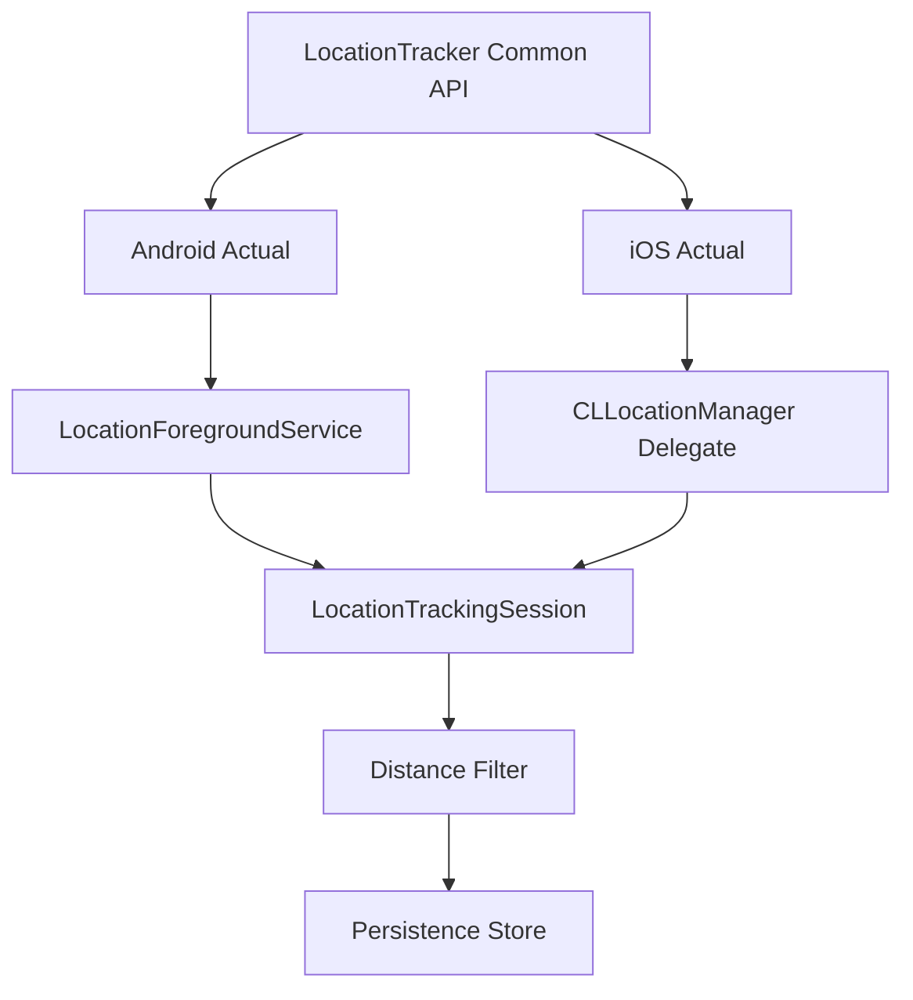

# Technical Documentation: Location Tracker Internals

This document provides a deep dive into the internal architecture and native implementations of the `location-tracker` library.

## Architecture Overview

The library follows a strict `expect`/`actual` pattern to provide a unified API while leveraging native platform capabilities for background execution.

## Android Implementation

### Foreground Service
On Android, background location is strictly throttled unless running within a Foreground Service.
- **Service**: `LocationForegroundService`
- **Type**: `location` (`android:foregroundServiceType="location"`)
- **Engine**: `FusedLocationProviderClient`
- **Lifecycle**: The service is started via `Context.startForegroundService()` and shows a persistent notification. It uses `START_STICKY` to ensure the OS attempts to restart it if killed under memory pressure.

### Permissions
- `ACCESS_FINE_LOCATION`
- `ACCESS_COARSE_LOCATION`
- `ACCESS_BACKGROUND_LOCATION` (Required for tracking when app is not visible)
- `FOREGROUND_SERVICE_LOCATION` (Required for API 34+)

## iOS Implementation

### CLLocationManager
On iOS, the library uses the standard location service with background capabilities enabled.
- **Configuration**:
    - `allowsBackgroundLocationUpdates = true`
    - `pausesLocationUpdatesAutomatically = false`
    - `showsBackgroundLocationIndicator = true` (Displays the blue banner/pill)
- **Background Mode**: Requires `location` background mode in `Info.plist`.

### Execution Path
When the app is suspended, iOS wakes the app briefly to deliver location updates to the `CLLocationManagerDelegate`. The library processes these updates and persists them immediately to ensure they are not lost if the app is terminated.

## Synchronization & Filtering Logic

### Distance Filtering (50m Rule)
To optimize battery and data usage, the library implements a Haversine distance filter.
1. The **first** valid fix after tracking starts is always accepted.
2. Every subsequent fix is compared against the **last successfully synced** location.
3. If the distance moved is **>= 50 meters** (or the configured `minDistanceThresholdMeters`), the location is marked `PENDING` and sent for sync.
4. If the distance is **< 50 meters**, the fix is marked `FILTERED` and ignored for syncing purposes.

### Durable Persistence
The `LocationTrackingSession` uses a platform-specific `TrackingSessionStore`:
- **Android**: `SharedPreferences`
- **iOS**: `NSUserDefaults`

This ensures that the "last sent location" and the "pending queue" survive app restarts, crashes, or service recreations.

## Tracking Modes

### 1. Time Range (Schedule)
The library can be configured with a `ScheduleWindow`.
- The `ScheduleEvaluator` checks the current local time against the window.
- If the current time is outside the window, the platform tracker is automatically paused or prevented from starting.

### 2. Check-In / Check-Out
- Tracking is only active when `isCheckedIn` is `true`.
- Toggling this status in the `LocationTrackerPolicy` immediately starts or stops the native tracking engine.

## API Decoupling
The SDK deliberately **does not** contain an HTTP client. It relies on a `LocationSyncListener` provided by the host application. This allows the host app to use its own networking stack, authentication, and error handling logic.
