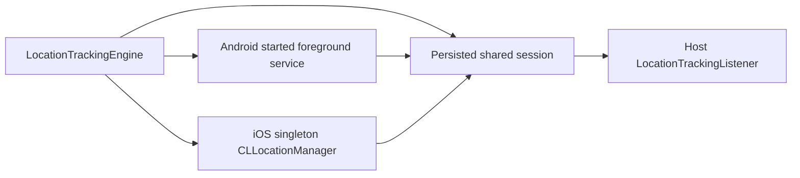

# Location Tracker Internals

`LocationTrackingEngine` is the library's application-lifecycle entry point. Initialize it before
any UI is composed, supplying a `LocationTrackingListener` that returns `true` only after the host
backend accepts an event.

## Shared session

`TrackingSessionState` persists active policy/configuration, session id, last raw location, last
successfully synced location, pending events, retry information, and next sync timestamp using
SharedPreferences on Android and NSUserDefaults on iOS.

Raw fixes are collected at the platform interval (30 seconds / 20m by default). Ongoing uploads
are evaluated only at the policy sync interval (5 minutes by default): `< 50m` is `FILTERED`,
`>= 50m` produces `LocationUpdated`, and only a successful listener response advances the sync
reference. `Started` and `Stopped` bypass the interval and distance filter.

## Platform ownership

- **Android:** a started `LocationForegroundService` owns FusedLocationProviderClient updates,
  survives ordinary task removal, is stopped by an explicit command, and restores persisted config
  after a null/redelivered service intent. A non-exported alarm receiver reconciles time windows.
- **iOS:** a singleton CLLocationManager coordinator owns standard background updates with Always
  authorization, the `location` background mode, and automatic pausing disabled. Significant
  location monitoring is a best-effort re-entry signal after normal system termination.

`TIME_RANGE` scheduling and `CHECK_IN_OUT` host policy updates both reconcile through the same
engine. Android force-stop and iOS user force-quit are operating-system boundaries: reopening the
application is required. See [`docs/LOCATION_TRACKING_FLOW.md`](../docs/LOCATION_TRACKING_FLOW.md)
for the complete lifecycle, host integration, status definitions, and device verification plan.
